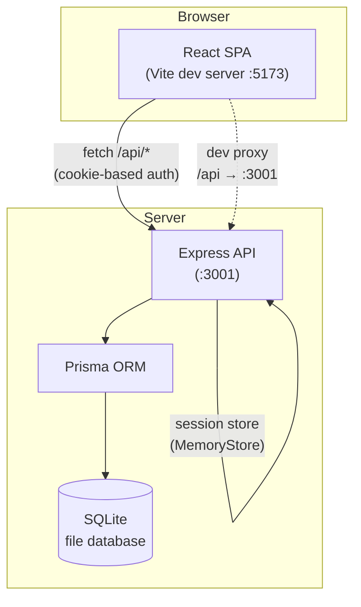
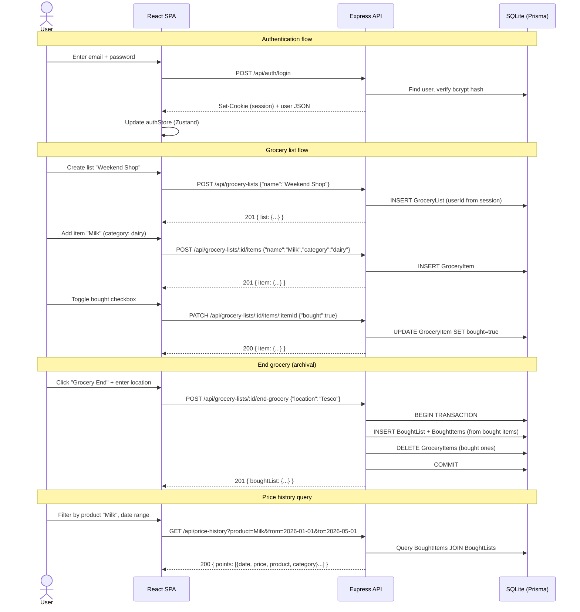
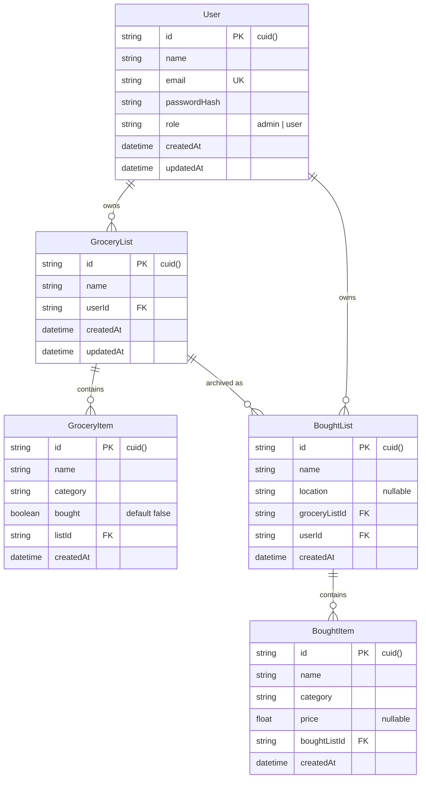
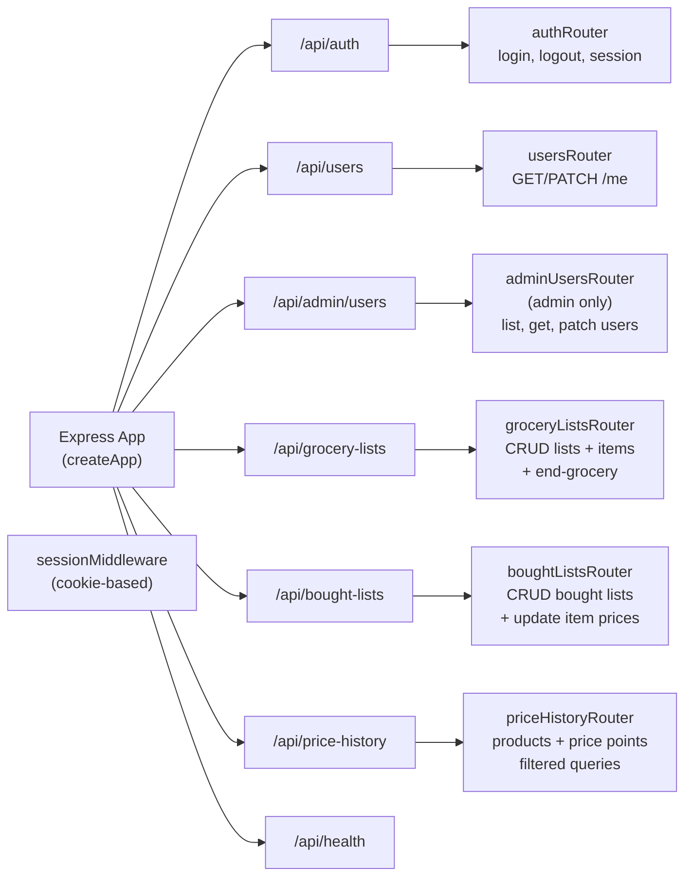
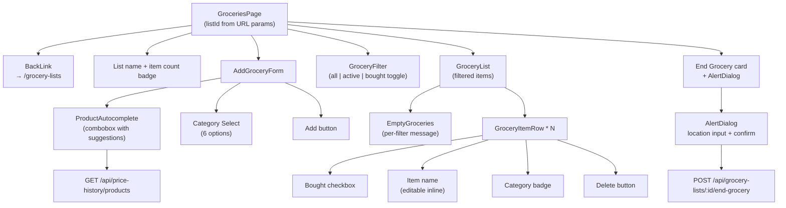
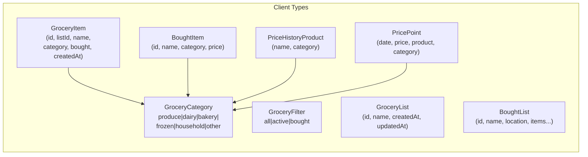

# Code Documentation — pricesImproved

> **Generated**: 2026-05-03  
> **Stack**: React + Vite + Express + Prisma + SQLite

---

## 1. Project Overview

**pricesImproved** is a full-stack grocery shopping list manager. Users create named grocery lists, add items to them, mark items as bought while shopping, and end a shopping trip — which archives the bought items into a dated `BoughtList` for later price tracking and analysis.

Key features:

| Feature | Description |
|---|---|
| Authentication | Cookie-based sessions (`express-session`), bcrypt-hashed passwords |
| Role-based access | `admin` role can manage all users |
| Grocery lists | Create, read, delete named lists |
| Grocery items | Add / edit / delete items with category and bought toggle |
| End grocery | Move bought items to a `BoughtList` with optional location |
| Bought lists | View past shopping trips, edit prices, export CSV |
| Price history | Query historical prices with product/category/date filters |
| Product autocomplete | Suggestions from previously bought products |

---

## 2. High-Level Architecture



The frontend communicates with the backend exclusively through REST calls to `/api/*` endpoints. Authentication is handled via HTTP‑only cookies. In development, Vite's dev server proxies `/api` requests to port 3001.

---

## 3. System Data Flow



---

## 4. Database Schema (Prisma + SQLite)



**Model relationships explained:**

- **User → GroceryList**: One user owns many grocery lists. Cascade deletes (delete user → delete all their lists).
- **GroceryList → GroceryItem**: One list contains many items. Cascade deletes.
- **GroceryList → BoughtList**: When a user ends a grocery trip, bought items are archived — the BoughtList references the original GroceryList.
- **BoughtList → BoughtItem**: Archived items with optional price data.

**Categories** (shared across GroceryItem and BoughtItem):

```
produce | dairy | bakery | frozen | household | other
```

---

## 5. Backend Architecture

### 5.1 Route Structure



### 5.2 Middleware Chain

```
express.json() → sessionMiddleware → [requireAuth] → route handler
```

- `sessionMiddleware`: Parses session cookie, loads session from `MemoryStore` (in dev).
- `requireAuth`: Checks `req.session.userId` exists, returns 401 if not.
- `requireAdmin`: Checks `req.session.role === "admin"`, returns 403 if not.

### 5.3 API Endpoints Reference

#### Auth
| Method | Path | Auth | Description |
|--------|------|------|-------------|
| `POST` | `/api/auth/login` | No | Login with email+password, creates session |
| `POST` | `/api/auth/logout` | Yes | Destroy session |

#### Users
| Method | Path | Auth | Description |
|--------|------|------|-------------|
| `GET` | `/api/users/me` | Yes | Get current user profile |
| `PATCH` | `/api/users/me` | Yes | Update own name |

#### Admin Users
| Method | Path | Auth | Description |
|--------|------|------|-------------|
| `GET` | `/api/admin/users` | Admin | List all users |
| `GET` | `/api/admin/users/:id` | Admin | Get single user |
| `PATCH` | `/api/admin/users/:id` | Admin | Update user name/role |

#### Grocery Lists
| Method | Path | Auth | Description |
|--------|------|------|-------------|
| `GET` | `/api/grocery-lists` | Yes | List user's grocery lists |
| `POST` | `/api/grocery-lists` | Yes | Create new grocery list |
| `GET` | `/api/grocery-lists/:id` | Yes | Get single grocery list |
| `DELETE` | `/api/grocery-lists/:id` | Yes | Delete list (cascade items) |
| `GET` | `/api/grocery-lists/:id/items` | Yes | Get items in list |
| `POST` | `/api/grocery-lists/:id/items` | Yes | Add item to list |
| `PATCH` | `/api/grocery-lists/:id/items/:itemId` | Yes | Update item (bought, name, category) |
| `DELETE` | `/api/grocery-lists/:id/items/:itemId` | Yes | Delete item from list |
| `POST` | `/api/grocery-lists/:id/end-grocery` | Yes | Archive bought items into BoughtList |

#### Bought Lists
| Method | Path | Auth | Description |
|--------|------|------|-------------|
| `GET` | `/api/bought-lists` | Yes | List user's bought lists |
| `GET` | `/api/bought-lists/:id` | Yes | Get bought list with items |
| `PATCH` | `/api/bought-lists/:id` | Yes | Update location |
| `DELETE` | `/api/bought-lists/:id` | Yes | Delete bought list |
| `PATCH` | `/api/bought-lists/:id/items/:itemId` | Yes | Update item price/category |

#### Price History
| Method | Path | Auth | Description |
|--------|------|------|-------------|
| `GET` | `/api/price-history/products` | Yes | List distinct products from bought items |
| `GET` | `/api/price-history?product=&category=&from=&to=` | Yes | Query price points with filters |

---

## 6. Frontend Architecture

### 6.1 Page Structure and Routing

```mermaid
graph TB
    ROOT["/"] --> REDIRECT["RootRedirect\n→ /dashboard or /login"]
    LOGIN["/login"] --> LoginPage
    DASHBOARD["/dashboard"] --> DashboardPage

    GLISTS["/grocery-lists"] --> GroceryListsPage
    GITEMS["/grocery-lists/:listId"] --> GroceriesPage

    BLISTS["/bought-lists"] --> BoughtListsPage
    BDETAIL["/bought-lists/:id"] --> BoughtListDetailPage

    PROFILE["/profile"] --> ProfilePage
    ADMIN["/admin/users"] --> AdminUsersPage
    ADMIN_EDIT["/admin/users/:id"] --> AdminUserEditPage

    subgraph Guards
        RequireAuth["RequireAuth wrapper\n(redirects to /login)"]
        RequireAdmin["RequireAdmin wrapper\n(redirects to /dashboard)"]
    end

    DASHBOARD --- RequireAuth
    GLISTS --- RequireAuth
    GITEMS --- RequireAuth
    BLISTS --- RequireAuth
    BDETAIL --- RequireAuth
    PROFILE --- RequireAuth
    ADMIN --- RequireAdmin
    ADMIN_EDIT --- RequireAdmin
```



### 6.2 Component Tree (GroceriesPage — the main shopping view)



### 6.3 State Management

- **Zustand** (`authStore`): Stores the current user object (name, email, role, id). Populated after login and cleared on logout.
- **React component state**: Individual pages manage their own data (items, filters, loading states).
- **No global grocery state**: Each page fetches its own data from the API.

### 6.4 API Client (`client/src/api/client.ts`)

The client module provides typed functions for every API endpoint. Key patterns:

```typescript
// All functions are async, throw on HTTP errors
export async function getGroceryItems(listId: string): Promise<GroceryItem[]>

// Use { credentials: "include" } for cookie-based session auth
const res = await fetch(`/api/grocery-lists/${listId}/items`, {
  credentials: "include",
});

// Parse JSON safely, extract typed payload
const body = (await readBody(res)) as { items?: GroceryItem[]; error?: string };
if (!res.ok) throw new Error(body?.error ?? "Request failed");
if (!body.items) throw new Error("Invalid response");
return body.items;
```

---

## 7. Key Files — Deep Dive

### 7.1 `server/src/routes/groceryLists.ts` (the core backend logic)

This file handles all grocery list operations. Key design decisions:

**Input validation is done manually** (not with zod on the server), mirroring the client-side validation:

```typescript
// Name validation
if (!name) → 400 "Name is required"
if (name.length > 100) → 400 "Name is too long"
if (!/^[A-Za-z0-9]+$/.test(name)) → 400 "Name can only contain letters and numbers"

// Category validation
if (!isGroceryCategory(categoryRaw)) → 400 "Invalid category"
```

**Ownership enforcement**: Every operation checks that the list belongs to the authenticated user:

```typescript
const list = await prisma.groceryList.findFirst({
  where: { id: listId, userId },  // userId from session
});
if (!list) { res.status(404) }  // Not found (not "forbidden" — don't leak existence)
```

**The `end-grocery` endpoint** uses a Prisma transaction to atomically create a BoughtList and delete the bought items:

```typescript
const boughtList = await prisma.$transaction(async (tx) => {
  // 1. Create BoughtList with nested BoughtItem creation
  const created = await tx.boughtList.create({
    data: {
      name: `${list.name} - ${date}`,
      location: location || null,
      groceryListId: list.id,
      userId,
      items: { create: boughtItems.map(item => ({ name, category })) },
    },
    include: { items: { orderBy: { createdAt: "asc" } } },
  });
  // 2. Delete the original GroceryItems that were bought
  await tx.groceryItem.deleteMany({
    where: { id: { in: boughtItems.map(i => i.id) }, listId },
  });
  return created;
});
```

**Public shape conversion** (`toPublicList`, `toPublicItem`, etc.): Transforms Prisma models (with `Date` objects) to plain JSON (with ISO strings). This keeps the API contract consistent.

---

### 7.2 `client/src/components/AddGroceryForm.tsx` (the add-item form)

This form uses three libraries working together:

| Library | Role |
|---------|------|
| `react-hook-form` | Form state management, submission handling |
| `zod` + `@hookform/resolvers/zod` | Schema validation |
| Sonner (`toast`) | Error notifications |

**Validation schema:**

```typescript
const schema = z.object({
  name: z.string()
    .trim()
    .min(1, "Name is required")
    .max(100, "Name must be 100 characters or less")
    .regex(/^[A-Za-z0-9]+$/, "Name can only contain letters and numbers"),
  category: z.enum(GROCERY_CATEGORIES),
});
```

**Key interaction with ProductAutocomplete:**

When the user selects a product from the autocomplete suggestions, the category is automatically set:

```typescript
<ProductAutocomplete
  onSelectProduct={(p) => {
    form.setValue("category", p.category, {
      shouldValidate: true,
      shouldDirty: true,
    });
  }}
/>
```

**Form layout** uses a responsive CSS grid:

```
Mobile:  Name    [full width]
         Category [full width]
         [Add button]

Desktop: [Name input ..........] [Category select] [Add]
         ← 1fr →                ← auto →         ← auto →
```

**After submission:**
- On success: Reset form to defaults, refocus name input
- On error: Show toast with error message

---

### 7.3 `client/src/components/ProductAutocomplete.tsx` (accessible combobox)

This is a custom autocomplete/combobox component with full ARIA support. It fetches product suggestions from the price history API.

**Accessibility features:**

| ARIA Attribute | Purpose |
|----------------|---------|
| `role="combobox"` | Identifies the input as a combobox |
| `aria-autocomplete="list"` | Tells screen readers suggestions come from a list |
| `aria-expanded` | Indicates whether the suggestion list is open |
| `aria-controls` | Links input to the listbox |
| `aria-activedescendant` | Points to the currently highlighted option |
| `role="listbox"` on the dropdown | Identifies the suggestion container |
| `role="option"` + `aria-selected` | Identifies each suggestion |

**Loading strategy:**
- Products are lazily loaded on first focus or when the user presses ArrowDown
- Once loaded, the result is cached for the component lifetime (`loaded` flag)
- Errors are shown inline below the input

**Keyboard navigation:**

| Key | Behavior |
|-----|----------|
| ArrowDown | Open dropdown if closed; move highlight down if open |
| ArrowUp | Move highlight up |
| Enter | Select highlighted suggestion |
| Escape | Close dropdown |

**Click-outside-to-close** uses a `mousedown` listener on `document` that checks if the click target is inside the component's root div.

---

### 7.4 `client/src/pages/GroceriesPage.tsx` (main shopping page)

This is the most complex page. It manages the entire shopping workflow.

**Loading states** are modeled as a discriminated union:

```typescript
type LoadState =
  | { status: "loading" }
  | { status: "notFound" }
  | { status: "error"; message: string }
  | { status: "ok" };
```

Each state renders different UI:
- `loading`: Skeleton placeholders for list name, form, filter, and item rows
- `notFound`: "List not found" card with back link
- `error`: Error card with message and retry link
- `ok`: Full interactive UI

**Optimistic UI pattern** for toggle bought:

```typescript
async function handleToggleBought(id: string) {
  const item = items.find((i) => i.id === id);
  if (!item) return;
  // Call API, get updated item back
  const updated = await updateGroceryItemInList(listId, id, { bought: !item.bought });
  // Replace in local state
  setItems((prev) => prev.map((it) => (it.id === id ? updated : it)));
}
```

Note: This is NOT optimistic in the strict sense — it waits for the server response before updating UI. This avoids inconsistency if the request fails.

**End grocery workflow:**
1. User clicks "Grocery End" → `AlertDialog` opens
2. User optionally enters a location (store name)
3. User confirms → API call to `endGrocery`
4. On success: Remove bought items from local state, show toast with "View" link to the new bought list
5. On error: Show error toast

---

## 8. Type System



The `GroceryCategory` type is defined identically in both client and server, and validated on both sides. The client defines it in `types/grocery.ts`, the server defines it inline in `groceryLists.ts` and `boughtLists.ts`.

---

## 9. File Map

```
pricesImproved/
├── client/                         # React + Vite frontend
│   └── src/
│       ├── api/
│       │   └── client.ts           # All API fetch functions
│       ├── components/
│       │   ├── AddGroceryForm.tsx   # ✦ Add item form (zod + react-hook-form)
│       │   ├── ProductAutocomplete.tsx  # Accessible combobox
│       │   ├── GroceryList.tsx      # List wrapper (empty state + items)
│       │   ├── GroceryItemRow.tsx   # Single item row
│       │   ├── GroceryFilter.tsx    # all/active/bought toggle
│       │   ├── EmptyGroceries.tsx   # Empty state component
│       │   ├── AppLayout.tsx        # Shell layout with nav
│       │   ├── RequireAuth.tsx      # Auth guard wrapper
│       │   ├── RequireAdmin.tsx     # Admin guard wrapper
│       │   ├── ThemeToggle.tsx      # Dark/light mode toggle
│       │   └── ui/                  # shadcn/ui primitives
│       ├── lib/
│       │   ├── filterGroceries.ts   # Filter items by status
│       │   ├── boughtListCsv.ts     # Export bought list as CSV
│       │   ├── importFile.ts        # Import file parsing
│       │   ├── filterPricePointsByLocalDate.ts
│       │   └── utils.ts             # cn() classname utility
│       ├── pages/
│       │   ├── GroceriesPage.tsx    # ✦ Main shopping page
│       │   ├── GroceryListsPage.tsx # List of grocery lists
│       │   ├── BoughtListsPage.tsx  # Past shopping trips
│       │   ├── BoughtListDetailPage.tsx  # Single trip detail
│       │   ├── DashboardPage.tsx    # Dashboard/home
│       │   ├── LoginPage.tsx        # Login form
│       │   ├── ProfilePage.tsx      # Edit own profile
│       │   ├── AdminUsersPage.tsx   # Admin user list
│       │   └── AdminUserEditPage.tsx # Admin edit user
│       ├── stores/
│       │   └── authStore.ts         # Zustand auth state
│       ├── types/
│       │   ├── grocery.ts           # Grocery types & constants
│       │   ├── groceryList.ts       # GroceryList type
│       │   ├── boughtList.ts        # BoughtList/BoughtItem types
│       │   ├── priceHistory.ts      # Price history types
│       │   └── user.ts              # User type
│       ├── test/                    # Test setup (MSW, test router)
│       ├── App.tsx                  # Root component + routes
│       └── main.tsx                 # Entry point
│
├── server/                         # Express + Prisma backend
│   ├── prisma/
│   │   └── schema.prisma           # Database schema (SQLite)
│   └── src/
│       ├── app.ts                  # Express app factory
│       ├── index.ts                # Server entry point
│       ├── session.ts              # Session configuration
│       ├── db.ts                   # Prisma client singleton
│       ├── middleware/
│       │   ├── requireAuth.ts      # Session check middleware
│       │   └── requireAdmin.ts     # Admin role check middleware
│       ├── routes/
│       │   ├── auth.ts             # Login/logout
│       │   ├── users.ts            # User profile
│       │   ├── adminUsers.ts       # Admin user management
│       │   ├── groceryLists.ts     # ✦ Core grocery logic
│       │   ├── boughtLists.ts      # Bought list management
│       │   └── priceHistory.ts     # Price history queries
│       ├── lib/
│       │   ├── password.ts         # bcrypt hashing
│       │   └── serializeUser.ts    # User → JSON serialization
│       ├── types/
│       │   └── session.d.ts        # Session type augmentation
│       └── __tests__/              # Route integration tests
│
└── docs/
    ├── 02-architecture/
    │   ├── architecture-summary.md
    │   └── decisions.md
    └── 03-slices/                  # Feature slice definitions
```

✦ = Files currently modified (per git status)

---

## 10. Validation Contract

Validation is duplicated between client and server — a deliberate choice for defense in depth:

| Rule | Client (zod) | Server (manual) |
|------|-------------|-----------------|
| Name required | `min(1)` | `!name` check |
| Name max 100 chars | `max(100)` | `name.length > 100` |
| Name alphanumeric only | `regex(/^[A-Za-z0-9]+$/)` | Same regex |
| Category must be valid enum | `z.enum(GROCERY_CATEGORIES)` | `isGroceryCategory()` |
| Bought must be boolean | n/a (checkbox) | `typeof body.bought !== "boolean"` |

---

## 11. Key Design Decisions

1. **Cookie-based sessions over JWT**: Sessions are stored server-side (`MemoryStore`), HTTP-only cookies prevent XSS token theft. Simpler than JWT for this use case.

2. **Zustand for auth only**: Only the global auth state uses Zustand. Grocery data is per-page React state. This keeps re-renders local and avoids stale global state.

3. **Manual validation on server**: While the client validates with zod, the server re-validates manually. This is simpler than sharing a zod schema between client and server and provides defense in depth.

4. **Discriminated union for loading state**: `LoadState` makes it impossible to render in an inconsistent state — you must handle each case explicitly.

5. **Prisma transaction for end-grocery**: The bought list creation and item deletion happen atomically. If either fails, neither persists.

6. **ARIA-compliant combobox**: The `ProductAutocomplete` component is built to WCAG standards with proper roles, states, and keyboard navigation.
